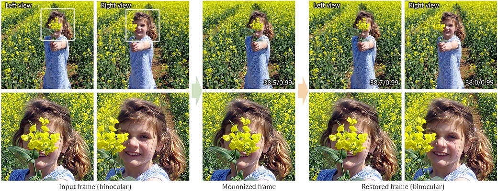

# Mononizing Binocular Videos

***ACM Transactions on Graphics (SIGGRAPH Asia 2020 issue), Vol. 39, No. 6, December 2020, pp. 228:1--228:16.***

[ [Project Webpage](https://wbhu.github.io/projects/Mono3D) ]    [ [arXiv](https://arxiv.org/abs/2009.01424) ]    [ [Video](https://youtu.be/rbZR_sF9B5E?list=PL3zJztb9e6XVa266_SeX0Dj66Vjy5f720) ]

Mono3D is the implementation of mono-nizing binocular videos into a regular monocular video with the stereo information implicitly encoded, such that the original binocular videos can be restored with high quality.




## Environment

Please refer to [env.yaml](./env.yaml).


## Dataset

We cannot release the whole 3D movie dataset due to copyright issues. But the binocular image dataset and part of the binocular video dataset used in the paper are publicly available: [[ Flickr1024 ]](https://yingqianwang.github.io/Flickr1024/) and [[ Inria ]](https://www.di.ens.fr/willow/research/stereoseg/).


## Evaluation

- Demo on a single scene

```shell
$ python main/demo.py --left ./imgs/demo_L.png
```

- Evaluation on the testing set of Flickr1024

```shell
$ sh scripts/test.sh mono3d_img config/Flickr1024/mono3d_img.yaml
```


## Training

Coming soon ...


## Copyright and License

You are granted with the [LICENSE](./LICENSE) for both academic and commercial usages.


